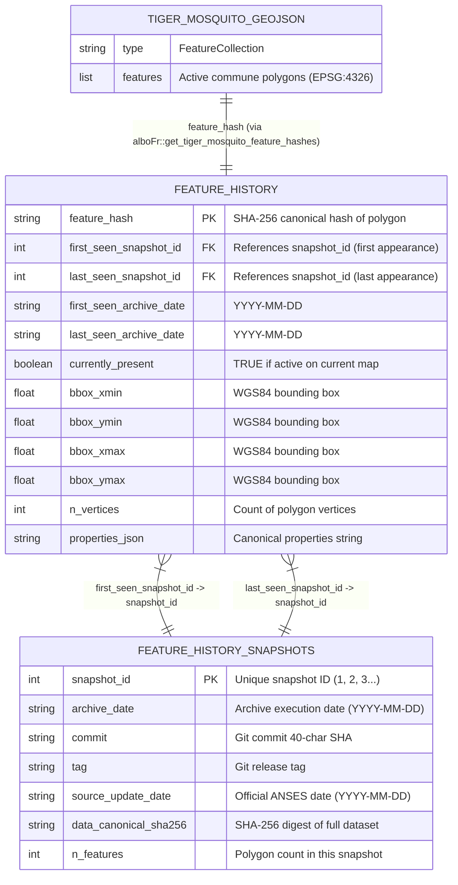

# Archive of Tiger Mosquito Colonisation Data in France

[](https://doi.org/10.5281/zenodo.14914293)
[](https://creativecommons.org/licenses/by/4.0/)

This repository is an automatic, versioned archive of French tiger mosquito (*Aedes albopictus*) colonisation data displayed on the official ANSES online map at [https://signalement-moustique.anses.fr/signalement_albopictus/colonisees](https://signalement-moustique.anses.fr/signalement_albopictus/colonisees).

The data is fetched automatically every week using the [`alboFr`](https://github.com/e-kotov/alboFr) R package. A new commit and release are created only when the canonical feature-set hash changes, ensuring that releases correspond to actual data updates rather than GeoJSON formatting or feature-ordering artifacts.

---

## 🗺️ Quick Start for GIS & Spatial Users

**Users who only want the current map of colonised French communes can simply drag and drop [`tiger_mosquito_colonisation_in_france.geojson`](tiger_mosquito_colonisation_in_france.geojson) directly into QGIS, ArcGIS, or load it with R (`sf::st_read()`) or Python (`geopandas.read_file()`).**

- It is lightweight, standard GeoJSON (EPSG:4326 / WGS84).
- It contains exactly the active polygons currently shown on the ANSES map.
- It contains no extra archive metadata that could interfere with standard GIS workflows.

---

## 🏛️ Why the Archive is Structured into Separate Files

Rather than forcing all historical metadata into a single massive file, the archive separates current spatial geometries from historical tracking tables:

1. **Clean Spatial Workflows (No Overlapping Polygons)**: Over time, ANSES occasionally redraws commune boundaries or retires polygons. If all historical polygons were stored in one GeoJSON file, GIS software would draw retired and active polygons on top of each other. Keeping `tiger_mosquito_colonisation_in_france.geojson` clean ensures immediate 1:1 mapping of active communes.
2. **Git Diff Efficiency**: Weekly automated runs verify data integrity. If weekly snapshot timestamps were embedded into every GeoJSON feature, every single feature would produce Git diff noise every week even when upstream data did not change.
3. **Full Longitudinal Provenance**: The companion tables (`feature_history.csv` and `feature_history_snapshots.csv`) maintain the complete lifecycle of every polygon ever seen (including retired ones), along with foreign keys to the exact Git commit, release tag, and snapshot date.

---

## 🔗 How Files are Connected (Relational Schema)

### Simple Explanation of Connections

The files connect like a relational database through two primary identifiers:

1. **`snapshot_id` (The Snapshot Foreign Key)**:
   - `feature_history_snapshots.csv` assigns a unique integer `snapshot_id` (1, 2, 3...) to each historical archive run.
   - `feature_history.csv` contains two foreign keys: `first_seen_snapshot_id` and `last_seen_snapshot_id`.
   - **How to join**: Joining `feature_history.csv` with `feature_history_snapshots.csv` on `first_seen_snapshot_id = snapshot_id` reveals the exact Git commit SHA, release tag, and ANSES update date when that commune polygon first appeared. Joining on `last_seen_snapshot_id = snapshot_id` gives the last time it was observed.

2. **`feature_hash` (The Spatial Feature Identifier)**:
   - `feature_hash` is a deterministic SHA-256 digest computed from the polygon geometry (normalized to 15-digit precision) and its sorted properties.
   - Every active polygon in `tiger_mosquito_colonisation_in_france.geojson` maps to a row in `feature_history.csv` via its canonical hash (computed via `alboFr::get_tiger_mosquito_feature_hashes()`).
   - If a polygon is modified or deleted upstream, its row in `feature_history.csv` is marked with `currently_present = FALSE`, while new boundaries receive a new `feature_hash`.



---

## 📖 Data Dictionary

### 1. `tiger_mosquito_colonisation_in_france.geojson`
Standard GeoJSON `FeatureCollection` (WGS84 / EPSG:4326) containing the latest active map snapshot.

| Field | Type | Description |
| :--- | :--- | :--- |
| `type` | String | `"FeatureCollection"` |
| `features[].type` | String | `"Feature"` |
| `features[].geometry.type` | String | `"Polygon"` |
| `features[].geometry.coordinates` | Array of float pairs | WGS84 Longitude / Latitude coordinates (`[[[lon, lat], ...]]]`) |
| `features[].properties.toujours_signaler` | Boolean | `true` if ANSES requests citizen mosquito reporting in this commune; `false` otherwise |

---

### 2. `feature_history.csv`
Cumulative registry tracking the lifecycle of every unique canonical polygon ever observed in the archive (one row per polygon).

| Column Name | Data Type | Description |
| :--- | :--- | :--- |
| `feature_hash` | `character` | **Primary Key.** 64-character SHA-256 canonical hash of the polygon geometry and properties |
| `first_seen_archive_date` | `character` (Date) | Date (`YYYY-MM-DD`) when this polygon was first recorded in this archive |
| `last_seen_archive_date` | `character` (Date) | Date (`YYYY-MM-DD`) when this polygon was most recently observed in this archive |
| `n_snapshots_seen` | `integer` | Total number of weekly archive snapshots in which this polygon appeared |
| `currently_present` | `logical` | `TRUE` if present in the latest active GeoJSON snapshot; `FALSE` if removed/modified upstream |
| `first_seen_snapshot_id` | `integer` | **Foreign Key** referencing `snapshot_id` in `feature_history_snapshots.csv` (first appearance) |
| `last_seen_snapshot_id` | `integer` | **Foreign Key** referencing `snapshot_id` in `feature_history_snapshots.csv` (most recent appearance) |
| `first_seen_release` | `character` | Git tag or ISO date when first released |
| `last_seen_release` | `character` | Git tag or ISO date when most recently released |
| `first_seen_source_update_date` | `character` (Date) | Official ANSES publication date associated with the first observation (`YYYY-MM-DD`) |
| `last_seen_source_update_date` | `character` (Date) | Official ANSES publication date associated with the latest observation (`YYYY-MM-DD`) |
| `bbox_xmin`, `bbox_ymin` | `double` | Minimum longitude and latitude (WGS84 bounding box) |
| `bbox_xmax`, `bbox_ymax` | `double` | Maximum longitude and latitude (WGS84 bounding box) |
| `n_vertices` | `integer` | Count of coordinate vertices in the exterior ring |
| `geometry_type` | `character` | `"Polygon"` |
| `properties_json` | `character` | Canonical radix-sorted JSON string of properties, e.g. `{"toujours_signaler":false}` |

---

### 3. `feature_history_snapshots.csv`
The archive audit ledger recording every historical snapshot and release execution (one row per snapshot).

| Column Name | Data Type | Description |
| :--- | :--- | :--- |
| `snapshot_id` | `integer` | **Primary Key.** Monotonically increasing identifier (1, 2, 3...) for each archive snapshot |
| `archive_date` | `character` (Date) | Date (`YYYY-MM-DD`) when the automated archive workflow executed |
| `commit` | `character` | 40-character Git commit SHA of the snapshot |
| `tag` | `character` | Git release tag for the snapshot (if a release was published) |
| `source_update_date` | `character` (Date) | Official update date parsed from the ANSES webpage (`YYYY-MM-DD`) |
| `feature_set_hash` | `character` | SHA-256 hash of concatenated unique feature hashes in the snapshot |
| `data_canonical_sha256` | `character` | Cryptographic SHA-256 hash of the canonical FeatureCollection (`alboFr::get_tiger_mosquito_dataset_hash`) |
| `n_features` | `integer` | Total number of polygon features present in this snapshot |

---

### 4. `metadata.json` / `SNAPSHOT.md`
Machine-readable (`.json`) and human-readable (`.md`) per-snapshot metadata generated on each release.

- `source_url`: Upstream ANSES map URL.
- `source_official_update_date`: Date displayed on the ANSES webpage when fetched.
- `fetched_at`: Precise ISO 8601 UTC timestamp of fetch (`YYYY-MM-DDTHH:MM:SSZ`).
- `data_canonical_sha256`: Canonical dataset hash.
- `previous_data_canonical_sha256`: Dataset hash from previous release.
- `features`: Count of features in GeoJSON.
- `alboFr_version` & `alboFr_remote_sha`: Version and Git commit of the `alboFr` extraction package.
- `workflow_run_id`: GitHub Actions execution run ID.
- `release_tag`: Release tag (`YYYY-MM-DD-<short_hash>`).

---

## 📅 Date Columns Explained

Because data is observed across different systems and cadences, the archive maintains multiple date fields:

1. **`fetched_at`**: The exact UTC timestamp (e.g. `2026-08-28T03:27:18Z`) when the network request was sent to ANSES.
2. **`archive_date`**: The date (e.g. `2026-08-28`) of the automated weekly execution and Git commit.
3. **`source_official_update_date` / `source_update_date`**: The official administrative update date parsed from French text on the ANSES webpage (`"Attention ! la carte a été actualisée le 29/04/2026"` $\rightarrow$ `2026-04-29`). ANSES updates their map periodically (seasonally or monthly), while this archive checks weekly.
4. **`first_seen_archive_date` / `last_seen_archive_date`**: The earliest and latest archive run dates where a specific polygon hash was present in the dataset.
5. **`first_seen_source_update_date` / `last_seen_source_update_date`**: The official ANSES publication date parsed during the first/last observation of that polygon (empty for snapshots prior to automated metadata parsing).

---

## 💻 Code Examples

Complete, runnable example scripts are provided in the [`examples/`](examples/) directory.

### R Example (using `dplyr` & `sf`)
```r
library(dplyr)
library(sf)

# 1. Load the history table, ledger, and GeoJSON
history <- read.csv("feature_history.csv", stringsAsFactors = FALSE)
snapshots <- read.csv("feature_history_snapshots.csv", stringsAsFactors = FALSE)
current_geo <- sf::st_read("tiger_mosquito_colonisation_in_france.geojson")

# 2. Join feature history with the snapshot ledger
history_annotated <- history %>%
  left_join(
    snapshots %>% select(snapshot_id, first_commit = commit, first_tag = tag, first_source_update = source_update_date),
    by = c("first_seen_snapshot_id" = "snapshot_id")
  ) %>%
  left_join(
    snapshots %>% select(snapshot_id, last_commit = commit, last_tag = tag, last_source_update = source_update_date),
    by = c("last_seen_snapshot_id" = "snapshot_id")
  )

# 3. Analyze newly colonised communes in 2026
new_2026 <- history_annotated %>%
  filter(first_seen_archive_date >= "2026-01-01")

# 4. Count active vs retired polygons
table(history_annotated$currently_present)
```

### Python Example (using `pandas` & `geopandas`)
```python
import pandas as pd
import geopandas as gpd

# 1. Load the tables and GeoJSON
history = pd.read_csv("feature_history.csv")
snapshots = pd.read_csv("feature_history_snapshots.csv")
current_geo = gpd.read_file("tiger_mosquito_colonisation_in_france.geojson")

# 2. Join feature history with snapshot ledger
history_annotated = history.merge(
    snapshots[["snapshot_id", "commit", "tag", "source_update_date"]].rename(
        columns={"commit": "first_commit", "tag": "first_tag", "source_update_date": "first_source_update"}
    ),
    left_on="first_seen_snapshot_id",
    right_on="snapshot_id",
    how="left"
).drop(columns=["snapshot_id"]).merge(
    snapshots[["snapshot_id", "commit", "tag", "source_update_date"]].rename(
        columns={"commit": "last_commit", "tag": "last_tag", "source_update_date": "last_source_update"}
    ),
    left_on="last_seen_snapshot_id",
    right_on="snapshot_id",
    how="left"
).drop(columns=["snapshot_id"])

# 3. Summary of active vs retired polygons
print(history_annotated["currently_present"].value_counts())
```

See [`examples/load_and_join_data.R`](examples/load_and_join_data.R) and [`examples/load_and_join_data.py`](examples/load_and_join_data.py) for full scripts.

---

## ⚙️ How Data is Generated

1. **Automated Weekly Fetch**: Every Saturday at 03:27 UTC, a GitHub Actions workflow executes [`scripts/fetch_data.R`](scripts/fetch_data.R), calling `alboFr::fetch_tiger_mosquito_page()` with configurable timeout and exponential backoff retries.
2. **Canonical JSON & Coordinate Normalisation**: Polygons extracted from the ANSES Javascript variable `var result_commune` are cleaned and parsed into a standard GeoJSON FeatureCollection. Coordinates are normalized to 15 significant digits and property keys are radix-sorted (ASCII byte order) to ensure cross-platform deterministic hashing.
3. **Change Detection**: The dataset hash is computed via `alboFr::get_tiger_mosquito_dataset_hash()`. If the hash matches the previous commit, the run finishes without creating unnecessary Git diffs or releases.
4. **History Compilation**: If new or modified polygons are detected, [`scripts/build_feature_history.R`](scripts/build_feature_history.R) updates `feature_history.csv` and appends a new entry to `feature_history_snapshots.csv`.
5. **Release & Archival Deposit**: A Git release is published with the updated data bundle and deposited to Zenodo under DOI [`10.5281/zenodo.14914293`](https://doi.org/10.5281/zenodo.14914293).

---

## ⚖️ License and Legal Notice

- The archive structure, compilation, metadata, and history tracking code are provided under the **Creative Commons Attribution 4.0 International (CC BY 4.0)** license.
- The original upstream spatial data is published by ANSES (*Agence nationale de sécurité sanitaire de l'alimentation, de l'environnement et du travail*). Consult the official ANSES legal notice at [https://signalement-moustique.anses.fr/signalement_albopictus/mentionslegales](https://signalement-moustique.anses.fr/signalement_albopictus/mentionslegales) prior to commercial reuse.
